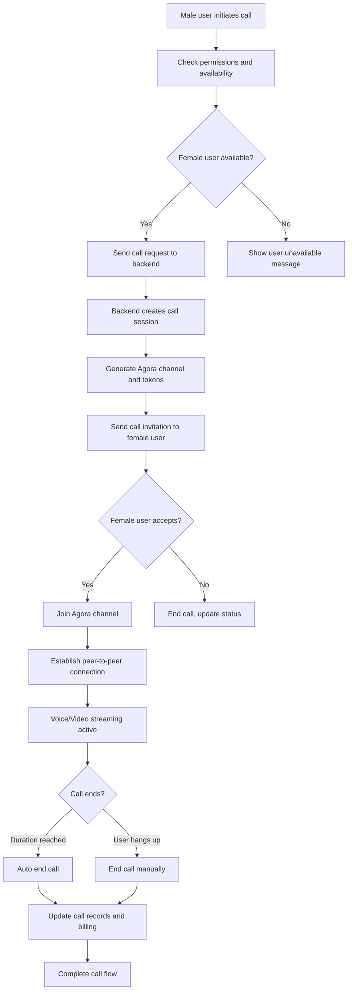
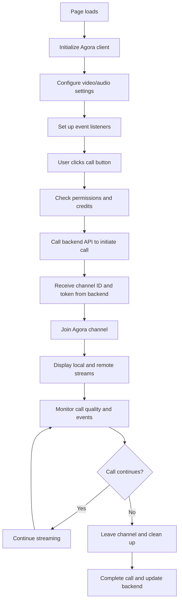
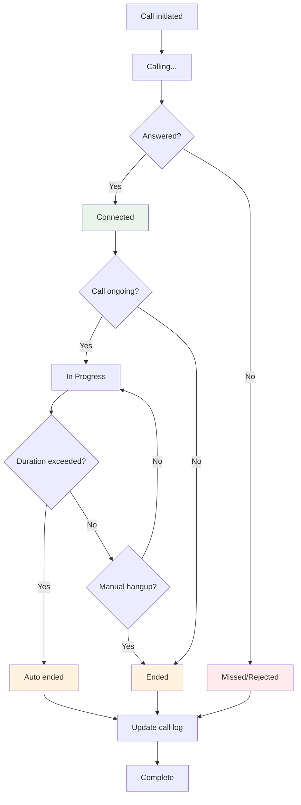

# Agora Integration Guide for Friend Circle App

This guide provides a comprehensive, step-by-step approach to integrating Agora video calling functionality in the frontend of the Friend Circle app. It covers account setup, SDK installation, API integration, and UI implementation.

## Table of Contents
1. [Overview](#overview)
2. [System Flow Diagrams](#system-flow-diagrams)
3. [Prerequisites](#prerequisites)
4. [Agora Account Setup](#agora-account-setup)
5. [Frontend SDK Installation](#frontend-sdk-installation)
6. [API Integration](#api-integration)
7. [UI Implementation](#ui-implementation)
8. [Call Flow Implementation](#call-flow-implementation)
9. [Error Handling](#error-handling)
10. [Testing](#testing)

## Overview

The Agora integration allows users to make voice and video calls between male and female users. The system consists of:
- **Frontend SDK**: Handles call initiation, connection, and UI
- **Backend API**: Manages call requests, permissions, and status
- **Agora Services**: Provides real-time communication infrastructure

## System Flow Diagrams

### 1. Overall Call Flow


### 2. Agora SDK Integration Flow


### 3. Call Status Management Flow


## Prerequisites

Before implementing Agora integration, ensure you have:
- Agora developer account with App ID and App Certificate
- Backend API endpoints for call management
- User authentication system (JWT tokens)
- Credit/balance system for call billing
- Proper permissions for camera and microphone access

## Agora Account Setup

### Step 1: Create Agora Developer Account
1. Go to [Agora.io](https://www.agora.io/)
2. Click "Sign Up" and create an account
3. Verify your email address
4. Log in to the Agora Console

### Step 2: Create a Project
1. In the Agora Console, click "Projects"
2. Click "Create"
3. Enter a project name (e.g., "FriendCircle")
4. Select "Media Call" as the product type
5. Choose "APP ID" as the authentication method
6. Select your preferred region(s)
7. Click "Submit"

### Step 3: Get App ID and Certificate
1. Once the project is created, copy the "App ID"
2. Click on your project name to view details
3. Go to "Project Management" → "Edit Project"
4. Copy the "Primary Certificate" (App Certificate)
5. Store these securely in your application

### Step 4: Enable Features
1. Go to "Modules" in your project
2. Enable the following features:
   - Real-time communication
   - Voice call
   - Video call
3. Configure token generation if using security tokens

## Frontend SDK Installation

### Step 1: Install Agora Web SDK
```bash
npm install agora-rtc-sdk-ng
```

Or include via CDN:
```html
<script src="https://download.agora.io/sdk/release/AgoraRTC_N-4.18.3.js"></script>
```

### Step 2: Import Agora Client
```javascript
import AgoraRTC from 'agora-rtc-sdk-ng';
// Or if using CDN:
// const AgoraRTC = window.AgoraRTC;
```

### Step 3: Configure Client
```javascript
// Initialize Agora client
const client = AgoraRTC.createClient({ mode: "rtc", codec: "vp8" });

// Configure client options
client.setClientRole("host"); // or "audience" for viewers
```

## API Integration

### Step 1: Call Initiation API
```javascript
// API to initiate a call
async function initiateCall(femaleUserId, callType = 'voice') {
  try {
    const response = await fetch('/api/v1/calls/initiate', {
      method: 'POST',
      headers: {
        'Content-Type': 'application/json',
        'Authorization': `Bearer ${jwtToken}`
      },
      body: JSON.stringify({
        receiverId: femaleUserId,
        callType: callType, // 'voice' or 'video'
        durationLimit: 60 // minutes
      })
    });
    
    if (!response.ok) {
      throw new Error('Failed to initiate call');
    }
    
    const data = await response.json();
    return data;
  } catch (error) {
    console.error('Error initiating call:', error);
    throw error;
  }
}
```

### Step 2: Get Agora Credentials API
```javascript
// API to get Agora channel credentials
async function getAgoraCredentials(callId) {
  try {
    const response = await fetch(`/api/v1/calls/${callId}/credentials`, {
      method: 'GET',
      headers: {
        'Authorization': `Bearer ${jwtToken}`
      }
    });
    
    if (!response.ok) {
      throw new Error('Failed to get Agora credentials');
    }
    
    const data = await response.json();
    return data;
  } catch (error) {
    console.error('Error getting Agora credentials:', error);
    throw error;
  }
}
```

### Step 3: Update Call Status API
```javascript
// API to update call status
async function updateCallStatus(callId, status, duration = null) {
  try {
    const response = await fetch(`/api/v1/calls/${callId}/status`, {
      method: 'PUT',
      headers: {
        'Content-Type': 'application/json',
        'Authorization': `Bearer ${jwtToken}`
      },
      body: JSON.stringify({
        status: status, // 'ongoing', 'ended', 'missed', 'rejected'
        duration: duration // in seconds
      })
    });
    
    if (!response.ok) {
      throw new Error('Failed to update call status');
    }
    
    return await response.json();
  } catch (error) {
    console.error('Error updating call status:', error);
    throw error;
  }
}
```

## UI Implementation

### Step 1: Create Call Interface
```html
<!-- Call container -->
<div id="call-container" class="call-container" style="display: none;">
  <!-- Remote video view -->
  <div id="remote-video" class="video-container">
    <div id="remote-stream" class="remote-stream"></div>
    <div id="remote-user-info" class="user-info">
      <h3 id="remote-user-name">Connecting...</h3>
      <p id="call-duration">00:00</p>
    </div>
  </div>
  
  <!-- Local video view -->
  <div id="local-video" class="video-container small">
    <div id="local-stream" class="local-stream"></div>
    <div class="local-controls">
      <button id="toggle-camera" class="control-btn active">📷</button>
      <button id="toggle-microphone" class="control-btn active">🎤</button>
    </div>
  </div>
  
  <!-- Call controls - available for both caller and callee -->
  <div id="call-controls" class="call-controls">
    <button id="end-call" class="end-call-btn">📞 End Call</button>
    <button id="accept-call" class="accept-call-btn" style="display: none;">✅ Accept</button>
    <button id="reject-call" class="reject-call-btn" style="display: none;">❌ Reject</button>
  </div>
</div>

<!-- Call invitation modal -->
<div id="call-invitation" class="call-invitation" style="display: none;">
  <div class="invitation-content">
    <h3>Call Invitation</h3>
    <p id="inviter-name">John Doe</p>
    <p>is calling you...</p>
    <div class="invitation-actions">
      <button id="accept-invitation" class="accept-btn">Accept</button>
      <button id="reject-invitation" class="reject-btn">Reject</button>
    </div>
  </div>
</div>
```

### Step 2: CSS Styling
```css
.call-container {
  position: fixed;
  top: 0;
  left: 0;
  width: 100%;
  height: 100%;
  background-color: #000;
  z-index: 10000;
  display: flex;
  flex-direction: column;
}

.video-container {
  position: relative;
  flex: 1;
  display: flex;
  justify-content: center;
  align-items: center;
}

.video-container.small {
  width: 150px;
  height: 200px;
  position: absolute;
  top: 20px;
  right: 20px;
  z-index: 10;
}

.remote-stream, .local-stream {
  width: 100%;
  height: 100%;
  background-color: #333;
}

.user-info {
  position: absolute;
  bottom: 20px;
  left: 20px;
  color: white;
  z-index: 5;
}

.user-info h3 {
  margin: 0;
  font-size: 1.2em;
}

.call-controls {
  position: absolute;
  bottom: 50px;
  width: 100%;
  display: flex;
  justify-content: center;
  gap: 20px;
}

.control-btn, .end-call-btn, .accept-call-btn, .reject-call-btn {
  padding: 15px 25px;
  border: none;
  border-radius: 50px;
  font-size: 16px;
  cursor: pointer;
  outline: none;
}

.end-call-btn {
  background-color: #e74c3c;
  color: white;
}

.accept-call-btn {
  background-color: #2ecc71;
  color: white;
}

.reject-call-btn {
  background-color: #e74c3c;
  color: white;
}

.local-controls {
  position: absolute;
  bottom: 10px;
  right: 10px;
  display: flex;
  gap: 10px;
  z-index: 5;
}

.control-btn {
  width: 40px;
  height: 40px;
  border-radius: 50%;
  display: flex;
  align-items: center;
  justify-content: center;
  background-color: rgba(255, 255, 255, 0.8);
}

.control-btn.active {
  background-color: #2ecc71;
  color: white;
}

.call-invitation {
  position: fixed;
  top: 0;
  left: 0;
  width: 100%;
  height: 100%;
  background-color: rgba(0, 0, 0, 0.8);
  z-index: 10001;
  display: flex;
  justify-content: center;
  align-items: center;
}

.invitation-content {
  background-color: white;
  padding: 30px;
  border-radius: 10px;
  text-align: center;
  max-width: 300px;
}

.invitation-actions {
  margin-top: 20px;
  display: flex;
  gap: 10px;
  justify-content: center;
}

.accept-btn {
  background-color: #2ecc71;
  color: white;
  padding: 10px 20px;
  border: none;
  border-radius: 5px;
  cursor: pointer;
}

.reject-btn {
  background-color: #e74c3c;
  color: white;
  padding: 10px 20px;
  border: none;
  border-radius: 5px;
  cursor: pointer;
}
```

## Call Flow Implementation

### Step 1: Initialize Agora Service
```javascript
class AgoraCallService {
  constructor() {
    this.client = null;
    this.localAudioTrack = null;
    this.localVideoTrack = null;
    this.remoteUsers = [];
    this.currentCall = null;
    this.callTimer = null;
    this.callStartTime = null;
    
    this.appId = 'YOUR_AGORA_APP_ID'; // Replace with your App ID
    this.channel = null;
    this.uid = null;
    this.token = null;
  }
  
  // Initialize Agora client
  async initialize() {
    this.client = AgoraRTC.createClient({ mode: "rtc", codec: "vp8" });
    
    // Set up event listeners
    this.setupEventListeners();
  }
  
  // Set up Agora event listeners
  setupEventListeners() {
    // When a remote user joins
    this.client.on("user-published", async (user, mediaType) => {
      await this.client.subscribe(user, mediaType);
      console.log("Subscribe success");
      
      if (mediaType === "video") {
        const remoteVideoTrack = user.videoTrack;
        remoteVideoTrack.play("remote-stream");
      } else if (mediaType === "audio") {
        const remoteAudioTrack = user.audioTrack;
        remoteAudioTrack.play();
      }
      
      this.remoteUsers.push(user);
    });
    
    // When a remote user leaves
    this.client.on("user-unpublished", (user, mediaType) => {
      if (mediaType === "video") {
        user.videoTrack && user.videoTrack.stop();
      }
      if (mediaType === "audio") {
        user.audioTrack && user.audioTrack.stop();
      }
      this.remoteUsers = this.remoteUsers.filter(u => u.uid !== user.uid);
    });
    
    // When connection state changes
    this.client.on("connection-state-change", (curState, revState) => {
      console.log(`Connection state changed from ${revState} to ${curState}`);
      
      if (curState === 'DISCONNECTED' && this.currentCall) {
        this.endCall();
      }
    });
  }
  
  // Join Agora channel
  async joinChannel(channel, uid, token) {
    this.channel = channel;
    this.uid = uid;
    this.token = token;
    
    // Join the channel
    this.uid = await this.client.join(this.appId, this.channel, this.token, this.uid);
    
    // Create local tracks
    this.localAudioTrack = await AgoraRTC.createMicrophoneAudioTrack();
    this.localVideoTrack = await AgoraRTC.createCameraVideoTrack();
    
    // Play local video
    this.localVideoTrack.play("local-stream");
    
    // Publish local tracks
    await this.client.publish([this.localAudioTrack, this.localVideoTrack]);
    
    console.log("Successfully joined channel");
  }
  
  // Leave Agora channel
  async leaveChannel() {
    if (this.localAudioTrack) {
      this.localAudioTrack.close();
    }
    if (this.localVideoTrack) {
      this.localVideoTrack.close();
    }
    
    await this.client.leave();
    console.log("Successfully left channel");
  }
  
  // Toggle camera
  async toggleCamera() {
    if (this.localVideoTrack) {
      if (this.localVideoTrack.enabled) {
        this.localVideoTrack.setEnabled(false);
        document.getElementById('toggle-camera').classList.remove('active');
      } else {
        await this.localVideoTrack.setEnabled(true);
        document.getElementById('toggle-camera').classList.add('active');
      }
    }
  }
  
  // Toggle microphone
  async toggleMicrophone() {
    if (this.localAudioTrack) {
      if (this.localAudioTrack.enabled) {
        this.localAudioTrack.setEnabled(false);
        document.getElementById('toggle-microphone').classList.remove('active');
      } else {
        await this.localAudioTrack.setEnabled(true);
        document.getElementById('toggle-microphone').classList.add('active');
      }
    }
  }
  
  // Start call timer
  startCallTimer() {
    this.callStartTime = new Date();
    this.callTimer = setInterval(() => {
      const elapsed = Math.floor((Date.now() - this.callStartTime.getTime()) / 1000);
      const minutes = Math.floor(elapsed / 60).toString().padStart(2, '0');
      const seconds = (elapsed % 60).toString().padStart(2, '0');
      document.getElementById('call-duration').textContent = `${minutes}:${seconds}`;
    }, 1000);
  }
  
  // Stop call timer
  stopCallTimer() {
    if (this.callTimer) {
      clearInterval(this.callTimer);
      this.callTimer = null;
    }
  }
  
  // End call
  async endCall(fromUser = 'local') {
    this.stopCallTimer();
    
    if (this.currentCall) {
      // Determine which API to call based on user type
      // If this is a female user ending the call, use female user API
      // Otherwise use male user API
      let apiEndpoint;
      if (currentUser.type === 'female') {
        apiEndpoint = '/api/female-user/calls/end';
      } else {
        apiEndpoint = '/api/male-user/calls/end';
      }
      
      // Update call status on backend
      const duration = Math.floor((Date.now() - this.callStartTime.getTime()) / 1000);
      const response = await fetch(apiEndpoint, {
        method: 'POST',
        headers: {
          'Content-Type': 'application/json',
          'Authorization': `Bearer ${jwtToken}`
        },
        body: JSON.stringify({
          receiverId: this.currentCall.receiverId || this.currentCall.otherUserId, // Depending on who initiated
          callerId: this.currentCall.callerId || this.currentCall.myUserId, // Depending on who is ending
          duration: duration,
          callType: this.currentCall.callType,
          callId: this.currentCall.id
        })
      });
      
      if (!response.ok) {
        const errorData = await response.json();
        console.error('Error ending call:', errorData);
        showError(errorData.message || 'Failed to end call');
      }
      
      // Notify other party that call has ended
      if (fromUser === 'local') {
        // If local user ended the call, send signal to remote user
        if (window.socket) {
          window.socket.emit('call_ended', {
            callId: this.currentCall.id,
            endedBy: 'local' // Indicates the local user ended the call
          });
        }
      }
      
      this.currentCall = null;
    }
    
    // Leave Agora channel
    await this.leaveChannel();
    
    // Hide call interface
    document.getElementById('call-container').style.display = 'none';
  }
  
  // Handle call ended by remote user
  handleRemoteCallEnded() {
    this.stopCallTimer();
    
    if (this.currentCall) {
      this.currentCall = null;
    }
    
    // Leave Agora channel
    this.leaveChannel().then(() => {
      // Hide call interface
      document.getElementById('call-container').style.display = 'none';
      
      // Show message that call was ended by other party
      showError('Call ended by the other party');
    }).catch(error => {
      console.error('Error leaving channel:', error);
      // Hide call interface anyway
      document.getElementById('call-container').style.display = 'none';
    });
  }
}
```

### Step 2: Call Management Functions
```javascript
// Global call service instance
const agoraService = new AgoraCallService();

// Initialize the service when page loads
document.addEventListener('DOMContentLoaded', async () => {
  await agoraService.initialize();
  setupCallEventListeners();
});

// Set up UI event listeners
function setupCallEventListeners() {
  // End call button
  document.getElementById('end-call').addEventListener('click', async () => {
    await agoraService.endCall();
  });
  
  // Toggle camera
  document.getElementById('toggle-camera').addEventListener('click', async () => {
    await agoraService.toggleCamera();
  });
  
  // Toggle microphone
  document.getElementById('toggle-microphone').addEventListener('click', async () => {
    await agoraService.toggleMicrophone();
  });
  
  // Accept invitation
  document.getElementById('accept-invitation').addEventListener('click', async () => {
    await acceptIncomingCall();
  });
  
  // Reject invitation
  document.getElementById('reject-invitation').addEventListener('click', async () => {
    await rejectIncomingCall();
  });
}

// Make a call to a user
async function makeCall(femaleUserId, callType = 'voice') {
  try {
    // Show calling interface
    document.getElementById('call-container').style.display = 'flex';
    document.getElementById('remote-user-name').textContent = 'Calling...';
    
    // Initiate call through backend
    const callData = await initiateCall(femaleUserId, callType);
    
    // Get Agora credentials
    const agoraCredentials = await getAgoraCredentials(callData.id);
    
    // Store current call
    agoraService.currentCall = callData;
    
    // Join Agora channel
    await agoraService.joinChannel(
      agoraCredentials.channel,
      agoraCredentials.uid,
      agoraCredentials.token
    );
    
    // Start call timer
    agoraService.startCallTimer();
    
    console.log('Call started successfully');
  } catch (error) {
    console.error('Error making call:', error);
    showError('Failed to make call. Please try again.');
    document.getElementById('call-container').style.display = 'none';
  }
}

// Handle incoming call invitation
async function showIncomingCall(inviterName, callData) {
  document.getElementById('inviter-name').textContent = inviterName;
  document.getElementById('call-invitation').style.display = 'flex';
  
  // Store call data for later use
  window.incomingCallData = callData;
}

// Accept incoming call
async function acceptIncomingCall() {
  try {
    const callData = window.incomingCallData;
    
    // Hide invitation modal
    document.getElementById('call-invitation').style.display = 'none';
    
    // Update call status to accepted
    await updateCallStatus(callData.id, 'accepted');
    
    // Show call interface
    document.getElementById('call-container').style.display = 'flex';
    document.getElementById('remote-user-name').textContent = callData.senderName;
    
    // Get Agora credentials
    const agoraCredentials = await getAgoraCredentials(callData.id);
    
    // Store current call
    agoraService.currentCall = callData;
    
    // Join Agora channel
    await agoraService.joinChannel(
      agoraCredentials.channel,
      agoraCredentials.uid,
      agoraCredentials.token
    );
    
    // Start call timer
    agoraService.startCallTimer();
    
    console.log('Call accepted successfully');
  } catch (error) {
    console.error('Error accepting call:', error);
    showError('Failed to accept call. Please try again.');
    document.getElementById('call-invitation').style.display = 'none';
  }
}

// Reject incoming call
async function rejectIncomingCall() {
  try {
    const callData = window.incomingCallData;
    
    // Update call status to rejected
    await updateCallStatus(callData.id, 'rejected');
    
    // Hide invitation modal
    document.getElementById('call-invitation').style.display = 'none';
    
    console.log('Call rejected successfully');
  } catch (error) {
    console.error('Error rejecting call:', error);
    showError('Failed to reject call.');
    document.getElementById('call-invitation').style.display = 'none';
  }
}

// Show error message
function showError(message) {
  // Create error element
  const errorDiv = document.createElement('div');
  errorDiv.className = 'error-message';
  errorDiv.textContent = message;
  errorDiv.style.cssText = `
    position: fixed;
    top: 20px;
    right: 20px;
    background-color: #e74c3c;
    color: white;
    padding: 15px 20px;
    border-radius: 5px;
    z-index: 10002;
  `;
  
  document.body.appendChild(errorDiv);
  
  // Remove after 5 seconds
  setTimeout(() => {
    errorDiv.remove();
  }, 5000);
}

// Listen for incoming call invitations via WebSocket
// This would typically be implemented based on your existing WebSocket setup
function setupCallWebSocketListener() {
  // Example: Listen for call invitation events
  socket.on('call_invitation', (data) => {
    showIncomingCall(data.senderName, data);
  });
  
  // Listen for call ended events
  socket.on('call_ended', (data) => {
    // Handle when remote user ends the call
    agoraService.handleRemoteCallEnded();
  });
  
  // Listen for call status updates
  socket.on('call_status_update', (data) => {
    handleCallStatusUpdate(data);
  });
}

// Handle call status updates
function handleCallStatusUpdate(data) {
  switch (data.status) {
    case 'ended':
      if (agoraService.currentCall && agoraService.currentCall.id === data.callId) {
        // Check if this is a remote call end (not triggered by local user)
        // The call_ended socket event should handle remote ends
        // This is just for backend status sync
        if (data.endedBy !== 'local') {
          agoraService.handleRemoteCallEnded();
        }
      }
      break;
    case 'rejected':
      if (agoraService.currentCall && agoraService.currentCall.id === data.callId) {
        agoraService.endCall();
        showError('Call was rejected');
      }
      break;
    case 'missed':
      if (agoraService.currentCall && agoraService.currentCall.id === data.callId) {
        agoraService.endCall();
        showError('Call was missed');
      }
      break;
  }
}
```

### Step 3: Integration with Existing Backend APIs
```javascript
// Function to check if user can make a call
async function canMakeCall(femaleUserId) {
  try {
    const response = await fetch(`/api/v1/users/${femaleUserId}/can-call`, {
      method: 'GET',
      headers: {
        'Authorization': `Bearer ${jwtToken}`
      }
    });
    
    if (!response.ok) {
      throw new Error('Cannot make call to this user');
    }
    
    const data = await response.json();
    return data.canCall;
  } catch (error) {
    console.error('Error checking call permission:', error);
    return false;
  }
}

// Function to get user balance/credits
async function getUserBalance() {
  try {
    const response = await fetch('/api/v1/users/balance', {
      method: 'GET',
      headers: {
        'Authorization': `Bearer ${jwtToken}`
      }
    });
    
    if (!response.ok) {
      throw new Error('Failed to get balance');
    }
    
    const data = await response.json();
    return data.balance;
  } catch (error) {
    console.error('Error getting balance:', error);
    return 0;
  }
}

// Function to check if user has sufficient balance
async function hasSufficientBalance(minimumCredits = 10) {
  const balance = await getUserBalance();
  return balance >= minimumCredits;
}
```

## Error Handling

### Step 1: Agora Error Handling
```javascript
// Enhanced AgoraCallService with error handling
class AgoraCallService {
  // ... previous code ...
  
  // Enhanced join channel with error handling
  async joinChannel(channel, uid, token) {
    try {
      this.channel = channel;
      this.uid = uid;
      this.token = token;
      
      // Join the channel
      this.uid = await this.client.join(this.appId, this.channel, this.token, this.uid);
      
      // Create local tracks with error handling
      try {
        this.localAudioTrack = await AgoraRTC.createMicrophoneAudioTrack();
      } catch (audioError) {
        console.warn('Failed to create audio track:', audioError);
        showError('Microphone access denied. Call will be audio-only.');
      }
      
      try {
        this.localVideoTrack = await AgoraRTC.createCameraVideoTrack();
        this.localVideoTrack.play("local-stream");
      } catch (videoError) {
        console.warn('Failed to create video track:', videoError);
        showError('Camera access denied. Call will be audio-only.');
      }
      
      // Publish available tracks
      const tracksToPublish = [];
      if (this.localAudioTrack) tracksToPublish.push(this.localAudioTrack);
      if (this.localVideoTrack) tracksToPublish.push(this.localVideoTrack);
      
      if (tracksToPublish.length > 0) {
        await this.client.publish(tracksToPublish);
      }
      
      console.log("Successfully joined channel");
    } catch (error) {
      console.error('Error joining channel:', error);
      showError('Failed to join call. Please check your connection.');
      throw error;
    }
  }
  
  // Enhanced error handling for device access
  async requestDeviceAccess() {
    try {
      // Test camera access
      const testStream = await navigator.mediaDevices.getUserMedia({ video: true });
      testStream.getTracks().forEach(track => track.stop());
      
      // Test microphone access
      const testAudioStream = await navigator.mediaDevices.getUserMedia({ audio: true });
      testAudioStream.getTracks().forEach(track => track.stop());
      
      return true;
    } catch (error) {
      console.error('Device access error:', error);
      if (error.name === 'NotAllowedError') {
        showError('Please allow camera and microphone access to make calls.');
      } else if (error.name === 'NotFoundError') {
        showError('No camera or microphone found on this device.');
      } else {
        showError('Could not access camera or microphone. Please check permissions.');
      }
      return false;
    }
  }
}
```

### Step 2: Network Error Handling
```javascript
// Enhanced API calls with retry logic
async function callAPIWithRetry(url, options, maxRetries = 3) {
  for (let i = 0; i < maxRetries; i++) {
    try {
      const response = await fetch(url, options);
      
      if (!response.ok) {
        throw new Error(`HTTP error! status: ${response.status}`);
      }
      
      return await response.json();
    } catch (error) {
      console.warn(`API call attempt ${i + 1} failed:`, error);
      
      if (i === maxRetries - 1) {
        // Final attempt failed
        throw error;
      }
      
      // Wait before retrying (exponential backoff)
      await new Promise(resolve => setTimeout(resolve, 1000 * (i + 1)));
    }
  }
}
```

## Testing

### Step 1: Test Call Initiation
1. Ensure Agora account is properly configured
2. Verify backend API endpoints are working
3. Test call initiation with a test user
4. Confirm Agora channel credentials are generated correctly

### Step 2: Test Device Access
1. Allow camera and microphone permissions when prompted
2. Verify local video stream displays correctly
3. Test camera and microphone toggle functionality
4. Confirm audio quality is acceptable

### Step 3: Test Call Connection
1. Initiate a call to another test user
2. Verify the call invitation is received
3. Accept the call and confirm connection
4. Test both audio and video functionality
5. Verify call duration timer works correctly

### Step 4: Test Call Termination
1. End the call using the end call button
2. Confirm call status is updated in backend
3. Verify both parties are disconnected
4. Check that call records are properly saved

### Step 5: Test Error Scenarios
1. Deny camera/microphone permissions
2. Test call with poor network connection
3. Simulate backend API failures
4. Verify proper error messages are displayed

## Security Considerations

1. **Secure Token Generation**: Use server-side token generation for production
2. **User Verification**: Validate user permissions before initiating calls
3. **Rate Limiting**: Implement call initiation limits to prevent abuse
4. **Data Encryption**: Ensure all communications are encrypted
5. **Privacy Controls**: Implement proper privacy settings for call visibility

## Performance Optimization

1. **Adaptive Bitrate**: Use Agora's adaptive bitrate features
2. **Resolution Control**: Allow users to adjust video quality
3. **Bandwidth Monitoring**: Monitor and adjust based on network conditions
4. **Resource Cleanup**: Properly dispose of tracks and connections
5. **Caching**: Cache Agora credentials to reduce backend calls

This comprehensive guide provides all the necessary information to integrate Agora calling functionality into your Friend Circle app frontend. Follow each step carefully to ensure a smooth implementation.