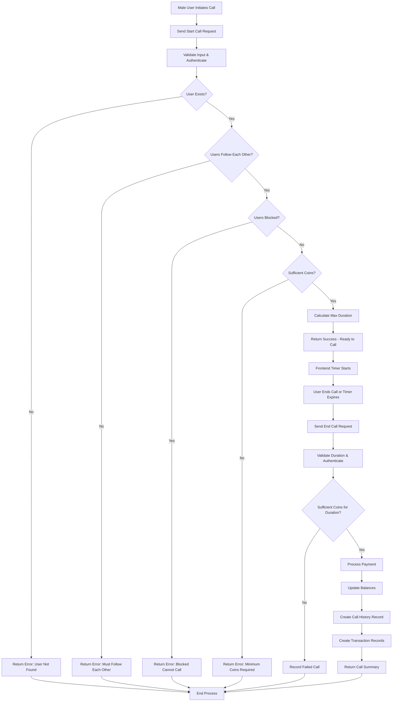

# CALL SYSTEM EXECUTION FLOW

This document provides a detailed explanation of the execution flow for the call system in the Friend Circle application, including sequence diagrams, process flows, and step-by-step execution details.

## Table of Contents
1. [Overview](#overview)
2. [Call Initiation Flow](#call-initiation-flow)
3. [Call Duration Management](#call-duration-management)
4. [Call Completion Flow](#call-completion-flow)
5. [Call History and Statistics Flow](#call-history-and-statistics-flow)
6. [Call Earnings Flow](#call-earnings-flow)
7. [System Flowchart](#system-flowchart)
8. [Error Handling Flow](#error-handling-flow)

## Overview

The call system in Friend Circle is a real-time communication system where male users can make audio/video calls to female users. The system operates on a coin-based payment model with the following key characteristics:

- Male users pay coins per second of call duration
- Female users earn coins which are credited to their wallet balance
- Users must follow each other to initiate a call
- Users cannot call if they have blocked each other
- Minimum coin balance required to start a call
- Real-time coin deduction based on call duration

## Call Initiation Flow

### 1. Pre-Call Validation Process

```
Male User Action → Frontend → API Request → Server Processing → Response
```

**Step-by-step execution:**

1. **Male User Initiates Call**
   - User selects a female user to call from the app interface
   - Frontend prepares API request with receiverId and callType (audio/video)

2. **API Request to Start Call**
   - Endpoint: `POST /male-user/calls/start`
   - Headers: Authorization token
   - Body: `{ receiverId: "female_user_id", callType: "video" }`

3. **Server Authentication**
   - Auth middleware validates JWT token
   - Extracts male user ID from token (`req.user._id`)

4. **Input Validation**
   - Checks if `receiverId` is provided
   - Returns error if missing: `messages.CALL.RECEIVER_REQUIRED`

5. **User Existence Verification**
   - Fetches male user from database by ID
   - Fetches female user from database by receiverId
   - Returns error if either user doesn't exist

6. **Follow Relationship Check**
   - Queries `MaleFollowing` collection: `{ maleUserId: callerId, femaleUserId: receiverId }`
   - Queries `FemaleFollowing` collection: `{ femaleUserId: receiverId, maleUserId: callerId }`
   - Both must exist for call to proceed
   - Returns error if not mutual followers: `messages.CALL.FOLLOW_EACH_OTHER`

7. **Block List Check**
   - Checks if female user has male user in block list: `receiver.blockList.includes(callerId)`
   - Checks if male user has female user in block list: `caller.blockList.includes(receiverId)`
   - Returns error if either has blocked the other: `messages.CALL.BLOCKED_CANNOT_CALL`

8. **Coin Balance Validation**
   - Retrieves `coinsPerSecond` rate from female user (default: 2)
   - Retrieves `minCallCoins` from AdminConfig (default: 60)
   - Checks if `caller.coinBalance >= minCallCoins`
   - Returns error if insufficient: `messages.CALL.MIN_COINS_REQUIRED(minCallCoins)`

9. **Max Duration Calculation**
   - Calculates `maxSeconds = Math.floor(caller.coinBalance / coinsPerSecond)`
   - Checks if `maxSeconds > 0` (has enough for at least 1 second)
   - Returns error if not: `messages.CALL.NOT_ENOUGH_COINS`

10. **Response to Frontend**
    - Success response with call details:
      ```json
      {
        "success": true,
        "message": "Call can be started",
        "data": {
          "maxSeconds": calculated_max_seconds,
          "coinsPerSecond": rate,
          "callerCoinBalance": balance,
          "minCallCoins": required_minimum
        }
      }
      ```

### 2. Call Duration Management

**Frontend Timer Implementation:**

1. **Timer Initialization**
   - Frontend receives `maxSeconds` from start call API
   - Initializes countdown timer with `maxSeconds`
   - Updates UI with remaining time

2. **Real-time Balance Tracking**
   - Calculates remaining coins: `remainingCoins = currentBalance - (secondsElapsed * coinsPerSecond)`
   - Updates UI with remaining coin balance

3. **Call End Trigger**
   - Timer reaches 0 → Automatic call end
   - User manually ends call → Manual call end
   - Insufficient coins → Automatic call end

## Call Completion Flow

### 1. Call End Process

```
Call End Trigger → API Request → Server Processing → Balance Update → Transaction Recording → Response
```

**Step-by-step execution:**

1. **Call End Trigger**
   - User manually ends call or timer expires
   - Frontend calculates actual call duration in seconds

2. **API Request to End Call**
   - Endpoint: `POST /male-user/calls/end`
   - Headers: Authorization token
   - Body: `{ receiverId: "female_user_id", duration: seconds, callType: "video" }`

3. **Server Authentication**
   - Auth middleware validates JWT token
   - Extracts male user ID from token (`req.user._id`)

4. **Input Validation**
   - Checks if `receiverId` and `duration` are provided
   - Validates `duration >= 0`
   - Returns error for invalid input

5. **User Existence Verification**
   - Fetches male user from database by ID
   - Fetches female user from database by receiverId
   - Returns error if either user doesn't exist

6. **Coin Balance Verification**
   - Retrieves `coinsPerSecond` rate from female user
   - Calculates `requestedCoins = duration * coinsPerSecond`
   - Checks if `caller.coinBalance >= requestedCoins`
   - Returns error if insufficient: `messages.CALL.INSUFFICIENT_COINS`

7. **Zero Duration Handling**
   - If `duration === 0`, no charges applied
   - Creates call record with status 'completed' and 0 coins
   - Returns success response

8. **Balance Deduction and Credit**
   - Deducts coins from male user: `caller.coinBalance -= requestedCoins`
   - Credits coins to female user: `receiver.walletBalance += requestedCoins`
   - Saves both user documents

9. **Call History Creation**
   - Creates `CallHistory` record with:
     - `callerId`, `receiverId`
     - `duration`, `coinsPerSecond`, `totalCoins`
     - `callType`, `status: 'completed'`

10. **Transaction Recording**
    - Creates debit transaction for male user
    - Creates credit transaction for female user
    - Links transactions to call history record

11. **Success Response**
    - Returns detailed call information:
      ```json
      {
        "success": true,
        "message": "Call ended successfully",
        "data": {
          "callId": call_record_id,
          "duration": actual_duration,
          "coinsPerSecond": rate,
          "totalCoins": coins_charged,
          "coinsDeducted": coins_deducted,
          "coinsCredited": coins_credited,
          "callerRemainingBalance": updated_caller_balance,
          "receiverNewBalance": updated_receiver_balance
        }
      }
      ```

## Call History and Statistics Flow

### 1. Male User Call History

**API Endpoint**: `GET /male-user/calls/history`

1. **Authentication**
   - Validates JWT token
   - Extracts user ID

2. **Query Parameters**
   - `limit` (default: 50)
   - `skip` (default: 0)

3. **Database Query**
   - Finds `CallHistory` records where `callerId = userId`
   - Populates receiver information
   - Sorts by creation date (newest first)
   - Applies pagination limits

4. **Response**
   - Returns call history with pagination info

### 2. Male User Call Statistics

**API Endpoint**: `GET /male-user/calls/stats`

1. **Authentication**
   - Validates JWT token
   - Extracts user ID

2. **Database Aggregation**
   - Aggregates `CallHistory` records where `callerId = userId`
   - Groups by null to calculate totals
   - Sums: total calls, total duration, total coins spent

3. **Response**
   - Returns aggregated statistics

## Call Earnings Flow

### 1. Female User Earnings History

**API Endpoint**: `GET /female-user/calls/earnings`

1. **Authentication and Review Status**
   - Validates JWT token
   - Checks if user review status is 'accepted'

2. **Query Parameters**
   - `limit` (default: 50)
   - `skip` (default: 0)

3. **Database Query**
   - Finds `CallHistory` records where `receiverId = userId` and `status = 'completed'`
   - Populates caller information
   - Sorts by creation date (newest first)
   - Applies pagination limits

4. **Response**
   - Returns earnings history with pagination info

### 2. Female User Earnings Statistics

**API Endpoint**: `GET /female-user/calls/earnings-stats`

1. **Authentication and Review Status**
   - Validates JWT token
   - Checks if user review status is 'accepted'

2. **Database Aggregation**
   - Aggregates `CallHistory` records where `receiverId = userId` and `status = 'completed'`
   - Groups by null to calculate totals
   - Sums: total calls, total duration, total earnings

3. **Response**
   - Returns aggregated earnings statistics

## System Flowchart



## Error Handling Flow

### 1. Start Call Error Scenarios

| Error Scenario | Condition | Error Message |
|----------------|-----------|---------------|
| Missing Receiver ID | `!receiverId` | `messages.CALL.RECEIVER_REQUIRED` |
| Caller Not Found | `!caller` | `messages.CALL.CALLER_NOT_FOUND` |
| Receiver Not Found | `!receiver` | `messages.CALL.RECEIVER_NOT_FOUND` |
| Not Following | `!isCallerFollowing || !isReceiverFollowing` | `messages.CALL.FOLLOW_EACH_OTHER` |
| Blocked Users | `isCallerBlocked || isReceiverBlocked` | `messages.CALL.BLOCKED_CANNOT_CALL` |
| Insufficient Coins | `caller.coinBalance < minCallCoins` | `messages.CALL.MIN_COINS_REQUIRED(minCallCoins)` |
| Not Enough for 1 Second | `maxSeconds <= 0` | `messages.CALL.NOT_ENOUGH_COINS` |

### 2. End Call Error Scenarios

| Error Scenario | Condition | Error Message |
|----------------|-----------|---------------|
| Missing Parameters | `!receiverId || duration === undefined` | `messages.CALL.DURATION_REQUIRED` |
| Negative Duration | `duration < 0` | `messages.CALL.DURATION_NEGATIVE` |
| Caller Not Found | `!caller` | `messages.CALL.CALLER_NOT_FOUND` |
| Receiver Not Found | `!receiver` | `messages.CALL.RECEIVER_NOT_FOUND` |
| Insufficient Coins | `caller.coinBalance < requestedCoins` | `messages.CALL.INSUFFICIENT_COINS` |

### 3. Error Handling Process

1. **Validation Errors**
   - Caught early in the process
   - Return 400 status with appropriate message
   - No database changes made

2. **Business Logic Errors**
   - Checked before processing
   - Return 400 status with detailed data
   - May create failed call records

3. **System Errors**
   - Caught by try-catch blocks
   - Return 500 status with error message
   - Logged for debugging

## Integration Points

### 1. External Dependencies

- **Authentication Middleware**: Validates JWT tokens
- **Review Status Middleware**: Ensures female users are accepted
- **Database Models**: MaleUser, FemaleUser, CallHistory, Transaction, AdminConfig
- **Message System**: Provides localized error messages

### 2. Data Consistency

- **Atomic Operations**: Balance updates and transaction creation happen in sequence
- **Transaction Records**: Created for both users to maintain audit trail
- **Call History**: Permanent record of all calls for analytics and disputes

### 3. Security Considerations

- **Authentication Required**: All endpoints protected by auth middleware
- **Input Validation**: All inputs validated before processing
- **Follow Verification**: Prevents unauthorized calling
- **Block List Check**: Respects user privacy preferences

## Performance Considerations

1. **Database Indexes**
   - `CallHistory.callerId` for male user queries
   - `CallHistory.receiverId` for female user queries
   - `CallHistory.createdAt` for time-based queries

2. **Caching Opportunities**
   - User profiles can be cached temporarily
   - Admin configurations can be cached

3. **Optimization Points**
   - Aggregation queries for statistics are efficient
   - Pagination prevents large data transfers
   - Input validation prevents unnecessary database queries