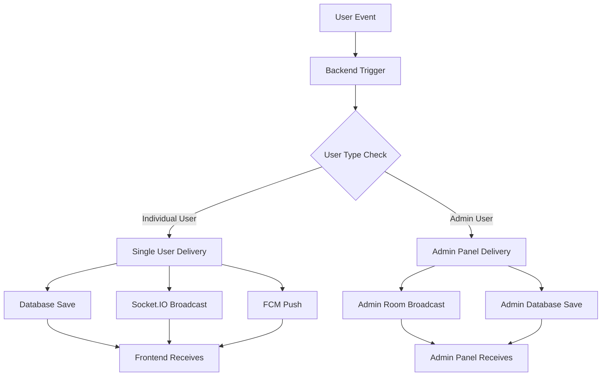

# Frontend Admin Notification System Integration Guide

This comprehensive guide provides detailed instructions for frontend developers to integrate the complete admin notification system into their applications. This includes real-time notifications, push notifications, and API interactions for managing the approval/rejection workflows.

## Table of Contents

1. [System Overview](#system-overview)
2. [Authentication Requirements](#authentication-requirements)
3. [API Integration Guide](#api-integration-guide)
4. [Real-time Notifications (WebSocket)](#real-time-notifications-websocket)
5. [Push Notifications](#push-notifications)
6. [UI Components Implementation](#ui-components-implementation)
7. [Data Structures and Interfaces](#data-structures-and-interfaces)
8. [Testing Checklist](#testing-checklist)

## System Overview

### Architecture


### Key Features
- **Real-time notifications** via WebSocket for instant delivery
- **Push notifications** via FCM for offline users
- **Admin panel integration** for approval/rejection workflows
- **User panel integration** for status updates
- **Notification management** (read/unread, mark all as read)
- **Multi-platform support** (web, mobile)

## Authentication Requirements

### JWT Token Structure
All API requests require a valid JWT token in the Authorization header:

```javascript
const headers = {
  'Authorization': `Bearer ${jwtToken}`,
  'Content-Type': 'application/json'
};
```

### User Types Supported
- `admin` - Administrative users
- `male` - Male users
- `female` - Female users
- `agency` - Agency users

## API Integration Guide

### 1. User Panel Notifications

#### Get User Notifications
```javascript
// GET /api/v1/notifications/user
async function getUserNotifications(page = 1, limit = 20, unreadOnly = false) {
  try {
    const response = await fetch(`${API_BASE_URL}/api/v1/notifications/user?page=${page}&limit=${limit}&unreadOnly=${unreadOnly}`, {
      method: 'GET',
      headers: {
        'Authorization': `Bearer ${jwtToken}`,
        'Content-Type': 'application/json'
      }
    });
    
    const data = await response.json();
    return data;
  } catch (error) {
    console.error('Error fetching notifications:', error);
    throw error;
  }
}

// Usage example
const notifications = await getUserNotifications(1, 10, false);
console.log('Notifications:', notifications.data.notifications);
```

#### Mark Single Notification as Read
```javascript
// PUT /api/v1/notifications/{notificationId}/read
async function markNotificationAsRead(notificationId) {
  try {
    const response = await fetch(`${API_BASE_URL}/api/v1/notifications/${notificationId}/read`, {
      method: 'PUT',
      headers: {
        'Authorization': `Bearer ${jwtToken}`,
        'Content-Type': 'application/json'
      }
    });
    
    const data = await response.json();
    return data;
  } catch (error) {
    console.error('Error marking notification as read:', error);
    throw error;
  }
}
```

#### Mark All Notifications as Read
```javascript
// PUT /api/v1/notifications/read-all
async function markAllNotificationsAsRead() {
  try {
    const response = await fetch(`${API_BASE_URL}/api/v1/notifications/read-all`, {
      method: 'PUT',
      headers: {
        'Authorization': `Bearer ${jwtToken}`,
        'Content-Type': 'application/json'
      }
    });
    
    const data = await response.json();
    return data;
  } catch (error) {
    console.error('Error marking all notifications as read:', error);
    throw error;
  }
}
```

#### Get Unread Count
```javascript
// GET /api/v1/notifications/counts
async function getUnreadCount() {
  try {
    const response = await fetch(`${API_BASE_URL}/api/v1/notifications/counts`, {
      method: 'GET',
      headers: {
        'Authorization': `Bearer ${jwtToken}`,
        'Content-Type': 'application/json'
      }
    });
    
    const data = await response.json();
    return data.data.unreadCount;
  } catch (error) {
    console.error('Error getting unread count:', error);
    throw error;
  }
}
```

### 2. Admin Panel Notifications

#### Get Admin Notifications
```javascript
// GET /api/v1/notifications/admin
async function getAdminNotifications(page = 1, limit = 20, unreadOnly = false, type = null) {
  try {
    let url = `${API_BASE_URL}/api/v1/notifications/admin?page=${page}&limit=${limit}&unreadOnly=${unreadOnly}`;
    if (type) {
      url += `&type=${type}`;
    }
    
    const response = await fetch(url, {
      method: 'GET',
      headers: {
        'Authorization': `Bearer ${adminJwtToken}`,
        'Content-Type': 'application/json'
      }
    });
    
    const data = await response.json();
    return data;
  } catch (error) {
    console.error('Error fetching admin notifications:', error);
    throw error;
  }
}

// Usage examples
const allAdminNotifications = await getAdminNotifications(1, 10);
const unreadOnly = await getAdminNotifications(1, 10, true);
const registrationRequests = await getAdminNotifications(1, 10, true, 'ACCOUNT_APPROVAL_REQUEST');
```

#### Admin Mark Notification as Read
```javascript
// PUT /api/v1/notifications/admin/{notificationId}/read
async function markAdminNotificationAsRead(notificationId) {
  try {
    const response = await fetch(`${API_BASE_URL}/api/v1/notifications/admin/${notificationId}/read`, {
      method: 'PUT',
      headers: {
        'Authorization': `Bearer ${adminJwtToken}`,
        'Content-Type': 'application/json'
      }
    });
    
    const data = await response.json();
    return data;
  } catch (error) {
    console.error('Error marking admin notification as read:', error);
    throw error;
  }
}
```

### 3. FCM Token Management

#### Save FCM Token
```javascript
// POST /api/v1/notifications/save-token
async function saveFCMToken(fcmToken, platform = 'web', deviceId = null) {
  try {
    const response = await fetch(`${API_BASE_URL}/api/v1/notifications/save-token`, {
      method: 'POST',
      headers: {
        'Authorization': `Bearer ${jwtToken}`,
        'Content-Type': 'application/json'
      },
      body: JSON.stringify({
        fcmToken,
        platform,
        deviceId
      })
    });
    
    const data = await response.json();
    return data;
  } catch (error) {
    console.error('Error saving FCM token:', error);
    throw error;
  }
}
```

#### Remove FCM Token
```javascript
// DELETE /api/v1/notifications/remove-token
async function removeFCMToken(fcmToken) {
  try {
    const response = await fetch(`${API_BASE_URL}/api/v1/notifications/remove-token`, {
      method: 'DELETE',
      headers: {
        'Authorization': `Bearer ${jwtToken}`,
        'Content-Type': 'application/json'
      },
      body: JSON.stringify({ token: fcmToken })
    });
    
    const data = await response.json();
    return data;
  } catch (error) {
    console.error('Error removing FCM token:', error);
    throw error;
  }
}
```

## Real-time Notifications (WebSocket)

### 1. Socket Connection Setup

```javascript
class NotificationService {
  constructor() {
    this.socket = null;
    this.isConnected = false;
    this.reconnectAttempts = 0;
    this.maxReconnectAttempts = 5;
  }

  // Initialize socket connection
  async connect(jwtToken) {
    try {
      // Import socket.io client
      const io = (await import('socket.io-client')).default;
      
      this.socket = io(API_BASE_URL, {
        transports: ['websocket'],
        reconnection: true,
        reconnectionDelay: 1000,
        reconnectionDelayMax: 5000,
        reconnectionAttempts: this.maxReconnectAttempts
      });

      // Authentication
      this.socket.emit('authenticate', jwtToken);

      // Connection events
      this.socket.on('connect', () => {
        console.log('Socket connected');
        this.isConnected = true;
        this.reconnectAttempts = 0;
      });

      this.socket.on('disconnect', () => {
        console.log('Socket disconnected');
        this.isConnected = false;
      });

      this.socket.on('authenticated', () => {
        console.log('Socket authentication successful');
        this.setupNotificationListeners();
      });

      this.socket.on('authentication_error', (error) => {
        console.error('Socket authentication failed:', error);
        this.handleReconnection();
      });

      this.socket.on('connect_error', (error) => {
        console.error('Socket connection error:', error);
        this.handleReconnection();
      });

    } catch (error) {
      console.error('Socket connection error:', error);
      this.handleReconnection();
    }
  }

  // Setup notification listeners
  setupNotificationListeners() {
    // Listen for general notifications
    this.socket.on('notification', (data) => {
      console.log('Received notification:', data);
      this.handleNotification(data);
    });

    // Listen for admin-specific notifications
    this.socket.on('admin:notification', (data) => {
      console.log('Received admin notification:', data);
      this.handleAdminNotification(data);
    });

    // Listen for specific notification types
    this.socket.on('notification:account_approval_request', (data) => {
      console.log('New account approval request:', data);
      this.handleAccountApprovalRequest(data);
    });

    this.socket.on('notification:kyc_submitted', (data) => {
      console.log('New KYC submission:', data);
      this.handleKYCSubmission(data);
    });

    this.socket.on('notification:withdrawal_request', (data) => {
      console.log('New withdrawal request:', data);
      this.handleWithdrawalRequest(data);
    });
  }

  // Handle incoming notifications
  handleNotification(data) {
    // Add to notification store
    this.addNotification({
      ...data,
      id: Date.now(),
      timestamp: new Date(),
      isRead: false
    });

    // Show browser notification
    this.showBrowserNotification(data);

    // Update UI
    this.updateNotificationBadge();
  }

  // Handle admin notifications specifically
  handleAdminNotification(data) {
    // Add to admin notification store
    this.addAdminNotification({
      ...data,
      id: Date.now(),
      timestamp: new Date(),
      isRead: false
    });

    // Show admin panel notification
    this.showAdminNotification(data);
  }

  // Handle reconnection
  handleReconnection() {
    if (this.reconnectAttempts < this.maxReconnectAttempts) {
      this.reconnectAttempts++;
      setTimeout(() => {
        console.log(`Reconnection attempt ${this.reconnectAttempts}`);
        this.connect(this.jwtToken);
      }, 1000 * this.reconnectAttempts);
    } else {
      console.error('Max reconnection attempts reached');
    }
  }

  // Disconnect socket
  disconnect() {
    if (this.socket) {
      this.socket.disconnect();
      this.socket = null;
      this.isConnected = false;
    }
  }
}
```

### 2. Usage Example

```javascript
// Initialize notification service
const notificationService = new NotificationService();

// Connect with JWT token
await notificationService.connect(userJwtToken);

// Get notifications
const notifications = await getUserNotifications(1, 10);

// Mark notification as read
await markNotificationAsRead(notificationId);

// Clean up on component unmount
notificationService.disconnect();
```

## Push Notifications

### 1. Firebase Setup

```javascript
class PushNotificationService {
  constructor() {
    this.messaging = null;
    this.fcmToken = null;
  }

  // Initialize Firebase
  async initializeFirebase() {
    try {
      // Import Firebase
      const { initializeApp } = await import('firebase/app');
      const { getMessaging, getToken } = await import('firebase/messaging');

      // Firebase configuration
      const firebaseConfig = {
        apiKey: "YOUR_API_KEY",
        authDomain: "YOUR_AUTH_DOMAIN",
        projectId: "YOUR_PROJECT_ID",
        storageBucket: "YOUR_STORAGE_BUCKET",
        messagingSenderId: "YOUR_MESSAGING_SENDER_ID",
        appId: "YOUR_APP_ID"
      };

      // Initialize Firebase
      const app = initializeApp(firebaseConfig);
      this.messaging = getMessaging(app);

      // Get FCM token
      this.fcmToken = await this.getFCMToken();
      
      if (this.fcmToken) {
        // Save token to backend
        await saveFCMToken(this.fcmToken, 'web');
        console.log('FCM token saved successfully');
      }

      // Handle foreground messages
      this.setupForegroundMessageHandler();

      return this.fcmToken;
    } catch (error) {
      console.error('Firebase initialization error:', error);
      return null;
    }
  }

  // Get FCM token
  async getFCMToken() {
    try {
      if (!this.messaging) return null;

      const token = await getToken(this.messaging, {
        vapidKey: 'YOUR_VAPID_KEY'
      });

      return token;
    } catch (error) {
      console.error('Error getting FCM token:', error);
      return null;
    }
  }

  // Setup foreground message handler
  setupForegroundMessageHandler() {
    if (!this.messaging) return;

    // Import onMessage
    import('firebase/messaging').then(({ onMessage }) => {
      onMessage(this.messaging, (payload) => {
        console.log('Foreground message received:', payload);
        
        // Show notification in UI
        this.showInAppNotification(payload);
        
        // Play notification sound
        this.playNotificationSound();
      });
    });
  }

  // Show in-app notification
  showInAppNotification(payload) {
    const notificationData = {
      title: payload.notification?.title || 'New Notification',
      body: payload.notification?.body || '',
      data: payload.data || {},
      timestamp: new Date()
    };

    // Add to notification store
    this.addNotification(notificationData);

    // Show toast/snackbar
    this.showToast(notificationData);
  }

  // Play notification sound
  playNotificationSound() {
    try {
      const audio = new Audio('/notification-sound.mp3');
      audio.play().catch(error => {
        console.log('Audio play failed:', error);
      });
    } catch (error) {
      console.log('Notification sound error:', error);
    }
  }

  // Add notification to store
  addNotification(notification) {
    // Implementation depends on your state management
    // Example with localStorage:
    const notifications = JSON.parse(localStorage.getItem('notifications') || '[]');
    notifications.unshift(notification);
    localStorage.setItem('notifications', JSON.stringify(notifications));
  }

  // Show toast notification
  showToast(notification) {
    // Implementation depends on your UI library
    // Example with a simple toast:
    const toast = document.createElement('div');
    toast.className = 'notification-toast';
    toast.innerHTML = `
      <div class="toast-title">${notification.title}</div>
      <div class="toast-body">${notification.body}</div>
    `;
    
    document.body.appendChild(toast);
    
    // Auto remove after 5 seconds
    setTimeout(() => {
      toast.remove();
    }, 5000);
  }
}
```

### 2. Service Worker Setup

Create `firebase-messaging-sw.js` in your public directory:

```javascript
// public/firebase-messaging-sw.js
importScripts('https://www.gstatic.com/firebasejs/9.0.0/firebase-app-compat.js');
importScripts('https://www.gstatic.com/firebasejs/9.0.0/firebase-messaging-compat.js');

// Firebase configuration
const firebaseConfig = {
  apiKey: "YOUR_API_KEY",
  authDomain: "YOUR_AUTH_DOMAIN",
  projectId: "YOUR_PROJECT_ID",
  storageBucket: "YOUR_STORAGE_BUCKET",
  messagingSenderId: "YOUR_MESSAGING_SENDER_ID",
  appId: "YOUR_APP_ID"
};

// Initialize Firebase
firebase.initializeApp(firebaseConfig);

// Retrieve Firebase Messaging object
const messaging = firebase.messaging();

// Handle background messages
messaging.onBackgroundMessage((payload) => {
  console.log('Received background message:', payload);
  
  const notificationTitle = payload.notification.title;
  const notificationOptions = {
    body: payload.notification.body,
    icon: '/icon-192x192.png',
    badge: '/badge-72x72.png',
    data: payload.data
  };

  return self.registration.showNotification(notificationTitle, notificationOptions);
});
```

## UI Components Implementation

### 1. Notification Bell Component

```javascript
class NotificationBell extends HTMLElement {
  constructor() {
    super();
    this.notifications = [];
    this.unreadCount = 0;
    this.isOpen = false;
  }

  connectedCallback() {
    this.render();
    this.setupEventListeners();
    this.loadNotifications();
  }

  async loadNotifications() {
    try {
      const response = await getUserNotifications(1, 10);
      this.notifications = response.data.notifications;
      this.unreadCount = response.data.unreadCount;
      this.updateBadge();
      this.renderDropdown();
    } catch (error) {
      console.error('Error loading notifications:', error);
    }
  }

  render() {
    this.innerHTML = `
      <div class="notification-bell">
        <button class="bell-button" id="bellButton">
          <i class="bell-icon">🔔</i>
          <span class="badge" id="notificationBadge">${this.unreadCount > 0 ? this.unreadCount : ''}</span>
        </button>
        <div class="notification-dropdown" id="notificationDropdown">
          <div class="dropdown-header">
            <h3>Notifications</h3>
            <button class="mark-all-read" id="markAllRead">Mark all as read</button>
          </div>
          <div class="notifications-list" id="notificationsList">
            ${this.renderNotifications()}
          </div>
        </div>
      </div>
    `;
  }

  renderNotifications() {
    if (this.notifications.length === 0) {
      return '<div class="no-notifications">No notifications</div>';
    }

    return this.notifications.map(notification => `
      <div class="notification-item ${notification.isRead ? 'read' : 'unread'}" 
           data-id="${notification._id}">
        <div class="notification-content">
          <div class="notification-title">${notification.title}</div>
          <div class="notification-message">${notification.message}</div>
          <div class="notification-time">${this.formatTime(notification.createdAt)}</div>
        </div>
        ${!notification.isRead ? '<div class="unread-indicator"></div>' : ''}
      </div>
    `).join('');
  }

  setupEventListeners() {
    const bellButton = this.querySelector('#bellButton');
    const markAllReadButton = this.querySelector('#markAllRead');
    const dropdown = this.querySelector('#notificationDropdown');

    bellButton.addEventListener('click', () => {
      this.toggleDropdown();
    });

    markAllReadButton.addEventListener('click', async () => {
      await this.markAllAsRead();
    });

    // Close dropdown when clicking outside
    document.addEventListener('click', (e) => {
      if (!this.contains(e.target)) {
        this.closeDropdown();
      }
    });

    // Handle notification clicks
    this.addEventListener('click', async (e) => {
      const notificationItem = e.target.closest('.notification-item');
      if (notificationItem) {
        const notificationId = notificationItem.dataset.id;
        await this.markAsRead(notificationId);
        this.handleNotificationClick(notificationId);
      }
    });
  }

  toggleDropdown() {
    this.isOpen = !this.isOpen;
    const dropdown = this.querySelector('#notificationDropdown');
    dropdown.style.display = this.isOpen ? 'block' : 'none';
  }

  closeDropdown() {
    this.isOpen = false;
    const dropdown = this.querySelector('#notificationDropdown');
    dropdown.style.display = 'none';
  }

  updateBadge() {
    const badge = this.querySelector('#notificationBadge');
    badge.textContent = this.unreadCount > 0 ? this.unreadCount : '';
    badge.style.display = this.unreadCount > 0 ? 'block' : 'none';
  }

  async markAsRead(notificationId) {
    try {
      await markNotificationAsRead(notificationId);
      const notification = this.notifications.find(n => n._id === notificationId);
      if (notification) {
        notification.isRead = true;
        this.unreadCount--;
        this.updateBadge();
        this.renderDropdown();
      }
    } catch (error) {
      console.error('Error marking notification as read:', error);
    }
  }

  async markAllAsRead() {
    try {
      await markAllNotificationsAsRead();
      this.notifications.forEach(notification => {
        notification.isRead = true;
      });
      this.unreadCount = 0;
      this.updateBadge();
      this.renderDropdown();
    } catch (error) {
      console.error('Error marking all notifications as read:', error);
    }
  }

  handleNotificationClick(notificationId) {
    const notification = this.notifications.find(n => n._id === notificationId);
    if (notification) {
      // Handle different notification types
      switch (notification.type) {
        case 'ACCOUNT_APPROVAL_REQUEST':
          // Navigate to user management page
          window.location.href = '/admin/users/pending';
          break;
        case 'KYC_SUBMITTED':
          // Navigate to KYC management page
          window.location.href = '/admin/kyc/pending';
          break;
        case 'WITHDRAWAL_REQUEST':
          // Navigate to withdrawal management page
          window.location.href = '/admin/withdrawals/pending';
          break;
        default:
          // Handle other notification types
          break;
      }
    }
  }

  formatTime(dateString) {
    const date = new Date(dateString);
    const now = new Date();
    const diff = now - date;
    
    if (diff < 60000) return 'Just now';
    if (diff < 3600000) return `${Math.floor(diff / 60000)}m ago`;
    if (diff < 86400000) return `${Math.floor(diff / 3600000)}h ago`;
    return date.toLocaleDateString();
  }
}

// Register the custom element
customElements.define('notification-bell', NotificationBell);
```

### 2. Admin Notification Panel

```javascript
class AdminNotificationPanel extends HTMLElement {
  constructor() {
    super();
    this.notifications = [];
    this.filters = {
      type: 'all',
      status: 'all'
    };
  }

  connectedCallback() {
    this.render();
    this.setupEventListeners();
    this.loadAdminNotifications();
  }

  async loadAdminNotifications() {
    try {
      const response = await getAdminNotifications(1, 50);
      this.notifications = response.data.notifications;
      this.renderNotifications();
    } catch (error) {
      console.error('Error loading admin notifications:', error);
    }
  }

  render() {
    this.innerHTML = `
      <div class="admin-notification-panel">
        <div class="panel-header">
          <h2>Admin Notifications</h2>
          <div class="filters">
            <select id="typeFilter">
              <option value="all">All Types</option>
              <option value="ACCOUNT_APPROVAL_REQUEST">Registration Requests</option>
              <option value="KYC_SUBMITTED">KYC Submissions</option>
              <option value="WITHDRAWAL_REQUEST">Withdrawal Requests</option>
            </select>
            <select id="statusFilter">
              <option value="all">All Status</option>
              <option value="unread">Unread</option>
              <option value="read">Read</option>
            </select>
          </div>
        </div>
        <div class="notifications-container">
          <div class="notifications-list" id="adminNotificationsList">
            ${this.renderAdminNotifications()}
          </div>
        </div>
      </div>
    `;
  }

  renderAdminNotifications() {
    const filteredNotifications = this.filterNotifications();
    
    if (filteredNotifications.length === 0) {
      return '<div class="no-notifications">No notifications found</div>';
    }

    return filteredNotifications.map(notification => `
      <div class="admin-notification-item ${notification.isRead ? 'read' : 'unread'}" 
           data-id="${notification._id}">
        <div class="notification-header">
          <span class="notification-type ${this.getTypeClass(notification.type)}">
            ${this.getTypeLabel(notification.type)}
          </span>
          <span class="notification-time">${this.formatTime(notification.createdAt)}</span>
        </div>
        <div class="notification-title">${notification.title}</div>
        <div class="notification-message">${notification.message}</div>
        <div class="notification-actions">
          ${this.renderActionButtons(notification)}
          <button class="mark-read-btn" data-id="${notification._id}">
            ${notification.isRead ? 'Mark as unread' : 'Mark as read'}
          </button>
        </div>
      </div>
    `).join('');
  }

  filterNotifications() {
    return this.notifications.filter(notification => {
      const typeMatch = this.filters.type === 'all' || notification.type === this.filters.type;
      const statusMatch = this.filters.status === 'all' || 
                         (this.filters.status === 'unread' && !notification.isRead) ||
                         (this.filters.status === 'read' && notification.isRead);
      return typeMatch && statusMatch;
    });
  }

  renderActionButtons(notification) {
    switch (notification.type) {
      case 'ACCOUNT_APPROVAL_REQUEST':
        return `
          <button class="action-btn approve" data-action="approve" data-id="${notification.data.userId}">
            Approve
          </button>
          <button class="action-btn reject" data-action="reject" data-id="${notification.data.userId}">
            Reject
          </button>
        `;
      case 'KYC_SUBMITTED':
        return `
          <button class="action-btn approve" data-action="approve-kyc" data-id="${notification.data.userId}">
            Approve KYC
          </button>
          <button class="action-btn reject" data-action="reject-kyc" data-id="${notification.data.userId}">
            Reject KYC
          </button>
        `;
      case 'WITHDRAWAL_REQUEST':
        return `
          <button class="action-btn approve" data-action="approve-withdrawal" data-id="${notification.data.withdrawalId}">
            Approve
          </button>
          <button class="action-btn reject" data-action="reject-withdrawal" data-id="${notification.data.withdrawalId}">
            Reject
          </button>
        `;
      default:
        return '';
    }
  }

  getTypeClass(type) {
    const typeClasses = {
      'ACCOUNT_APPROVAL_REQUEST': 'registration',
      'KYC_SUBMITTED': 'kyc',
      'WITHDRAWAL_REQUEST': 'withdrawal'
    };
    return typeClasses[type] || 'default';
  }

  getTypeLabel(type) {
    const typeLabels = {
      'ACCOUNT_APPROVAL_REQUEST': 'Registration',
      'KYC_SUBMITTED': 'KYC',
      'WITHDRAWAL_REQUEST': 'Withdrawal'
    };
    return typeLabels[type] || type;
  }

  setupEventListeners() {
    // Filter change handlers
    const typeFilter = this.querySelector('#typeFilter');
    const statusFilter = this.querySelector('#statusFilter');
    
    typeFilter.addEventListener('change', (e) => {
      this.filters.type = e.target.value;
      this.renderNotifications();
    });
    
    statusFilter.addEventListener('change', (e) => {
      this.filters.status = e.target.value;
      this.renderNotifications();
    });

    // Action button handlers
    this.addEventListener('click', async (e) => {
      const actionBtn = e.target.closest('.action-btn');
      const markReadBtn = e.target.closest('.mark-read-btn');
      
      if (actionBtn) {
        await this.handleAction(actionBtn);
      }
      
      if (markReadBtn) {
        await this.handleMarkRead(markReadBtn);
      }
    });
  }

  async handleAction(button) {
    const action = button.dataset.action;
    const id = button.dataset.id;
    
    try {
      switch (action) {
        case 'approve':
          await this.approveUser(id);
          break;
        case 'reject':
          await this.rejectUser(id);
          break;
        case 'approve-kyc':
          await this.approveKYC(id);
          break;
        case 'reject-kyc':
          await this.rejectKYC(id);
          break;
        case 'approve-withdrawal':
          await this.approveWithdrawal(id);
          break;
        case 'reject-withdrawal':
          await this.rejectWithdrawal(id);
          break;
      }
      
      // Reload notifications after action
      await this.loadAdminNotifications();
    } catch (error) {
      console.error('Error handling action:', error);
      alert('Error performing action. Please try again.');
    }
  }

  async handleMarkRead(button) {
    const notificationId = button.dataset.id;
    try {
      await markAdminNotificationAsRead(notificationId);
      await this.loadAdminNotifications();
    } catch (error) {
      console.error('Error marking notification as read:', error);
    }
  }

  // API action methods (implement based on your API structure)
  async approveUser(userId) {
    // Implement your approval API call
    const response = await fetch(`${API_BASE_URL}/admin/users/female/${userId}/approve`, {
      method: 'PUT',
      headers: {
        'Authorization': `Bearer ${adminJwtToken}`,
        'Content-Type': 'application/json'
      }
    });
    return response.json();
  }

  async rejectUser(userId) {
    const reason = prompt('Enter rejection reason:');
    if (!reason) return;
    
    const response = await fetch(`${API_BASE_URL}/admin/users/female/${userId}/reject`, {
      method: 'PUT',
      headers: {
        'Authorization': `Bearer ${adminJwtToken}`,
        'Content-Type': 'application/json'
      },
      body: JSON.stringify({ reason })
    });
    return response.json();
  }

  async approveKYC(userId) {
    const response = await fetch(`${API_BASE_URL}/admin/users/female/${userId}/kyc/approve`, {
      method: 'PUT',
      headers: {
        'Authorization': `Bearer ${adminJwtToken}`,
        'Content-Type': 'application/json'
      }
    });
    return response.json();
  }

  async rejectKYC(userId) {
    const reason = prompt('Enter KYC rejection reason:');
    if (!reason) return;
    
    const response = await fetch(`${API_BASE_URL}/admin/users/female/${userId}/kyc/reject`, {
      method: 'PUT',
      headers: {
        'Authorization': `Bearer ${adminJwtToken}`,
        'Content-Type': 'application/json'
      },
      body: JSON.stringify({ reason })
    });
    return response.json();
  }

  async approveWithdrawal(withdrawalId) {
    const response = await fetch(`${API_BASE_URL}/admin/withdrawals/${withdrawalId}/approve`, {
      method: 'PUT',
      headers: {
        'Authorization': `Bearer ${adminJwtToken}`,
        'Content-Type': 'application/json'
      }
    });
    return response.json();
  }

  async rejectWithdrawal(withdrawalId) {
    const reason = prompt('Enter withdrawal rejection reason:');
    if (!reason) return;
    
    const response = await fetch(`${API_BASE_URL}/admin/withdrawals/${withdrawalId}/reject`, {
      method: 'PUT',
      headers: {
        'Authorization': `Bearer ${adminJwtToken}`,
        'Content-Type': 'application/json'
      },
      body: JSON.stringify({ reason })
    });
    return response.json();
  }

  formatTime(dateString) {
    const date = new Date(dateString);
    return date.toLocaleString();
  }
}

customElements.define('admin-notification-panel', AdminNotificationPanel);
```

## Data Structures and Interfaces

### Notification Object Structure

```javascript
interface Notification {
  _id: string;
  receiverId: string | null;        // null for admin notifications
  receiverType: 'admin' | 'male' | 'female' | 'agency';
  title: string;
  message: string;
  type: string;
  data: Record<string, any>;
  isRead: boolean;
  readAt?: Date;
  createdAt: Date;
  updatedAt: Date;
}

// Example notification types and their data structures
const notificationTypes = {
  ACCOUNT_APPROVAL_REQUEST: {
    userId: string,
    userType: 'female' | 'agency',
    userName: string,
    email: string,
    mobileNumber: string
  },
  
  KYC_SUBMITTED: {
    userId: string,
    userType: 'female' | 'agency',
    userName: string,
    kycType: 'bank' | 'upi',
    submissionDate: Date
  },
  
  WITHDRAWAL_REQUEST: {
    withdrawalId: string,
    userId: string,
    userName: string,
    amount: number,
    method: 'bank' | 'upi',
    requestDate: Date
  },
  
  ACCOUNT_APPROVED: {
    adminName: string,
    approvalDate: Date
  },
  
  ACCOUNT_REJECTED: {
    adminName: string,
    reason: string,
    rejectionDate: Date
  }
};
```

### API Response Structures

```javascript
interface ApiResponse<T> {
  success: boolean;
  message?: string;
  data?: T;
  error?: string;
}

interface NotificationResponse {
  notifications: Notification[];
  unreadCount: number;
  totalPages: number;
  currentPage: number;
}

interface AdminNotificationResponse {
  notifications: Notification[];
  unreadCount: number;
  pendingRequests: {
    registrations: number;
    kyc: number;
    withdrawals: number;
  };
}
```

## Testing Checklist

### 1. API Integration Testing
- [ ] Test all notification endpoints with valid/invalid tokens
- [ ] Verify pagination and filtering work correctly
- [ ] Test mark as read functionality
- [ ] Verify unread count updates properly
- [ ] Test FCM token registration and removal

### 2. WebSocket Testing
- [ ] Verify socket connection and authentication
- [ ] Test real-time notification delivery
- [ ] Check reconnection logic
- [ ] Verify admin room broadcasts
- [ ] Test specific notification type events

### 3. Push Notification Testing
- [ ] Test FCM token generation
- [ ] Verify foreground message handling
- [ ] Test background notifications
- [ ] Check notification click handling
- [ ] Verify service worker registration

### 4. UI Component Testing
- [ ] Test notification bell dropdown functionality
- [ ] Verify admin panel filters work
- [ ] Test action button functionality
- [ ] Check responsive design
- [ ] Verify accessibility compliance

### 5. Integration Testing
- [ ] Test complete workflow: user action → notification → admin action → user notification
- [ ] Verify all notification types are handled correctly
- [ ] Test edge cases (network failures, invalid data)
- [ ] Verify proper error handling and user feedback

### 6. Performance Testing
- [ ] Test with large number of notifications
- [ ] Verify pagination performance
- [ ] Check memory usage with real-time updates
- [ ] Test concurrent notification handling

## Best Practices

1. **Error Handling**: Always implement proper error handling with user-friendly messages
2. **State Management**: Use consistent state management for notifications across components
3. **Performance**: Implement pagination and virtual scrolling for large notification lists
4. **Security**: Validate all data and implement proper authentication checks
5. **Accessibility**: Ensure all notification components are accessible
6. **Offline Support**: Implement proper offline handling and synchronization
7. **User Experience**: Provide clear visual feedback for all notification actions

## Troubleshooting

### Common Issues

1. **Socket Connection Failures**
   - Check JWT token validity
   - Verify server is running
   - Check network connectivity

2. **Push Notification Issues**
   - Verify FCM configuration
   - Check browser notification permissions
   - Ensure service worker is registered

3. **API Errors**
   - Validate request parameters
   - Check authentication headers
   - Verify server logs for detailed errors

4. **UI Update Issues**
   - Check for race conditions
   - Verify state updates are properly triggered
   - Ensure proper event handling

### Debugging Tips

1. Use browser developer tools to monitor network requests
2. Enable verbose logging in development
3. Test with different user roles and permissions
4. Use mock data for UI development
5. Implement proper error boundaries

---

This guide provides a comprehensive foundation for implementing the admin notification system in your frontend application. Customize the components and styling to match your application's design system and requirements.