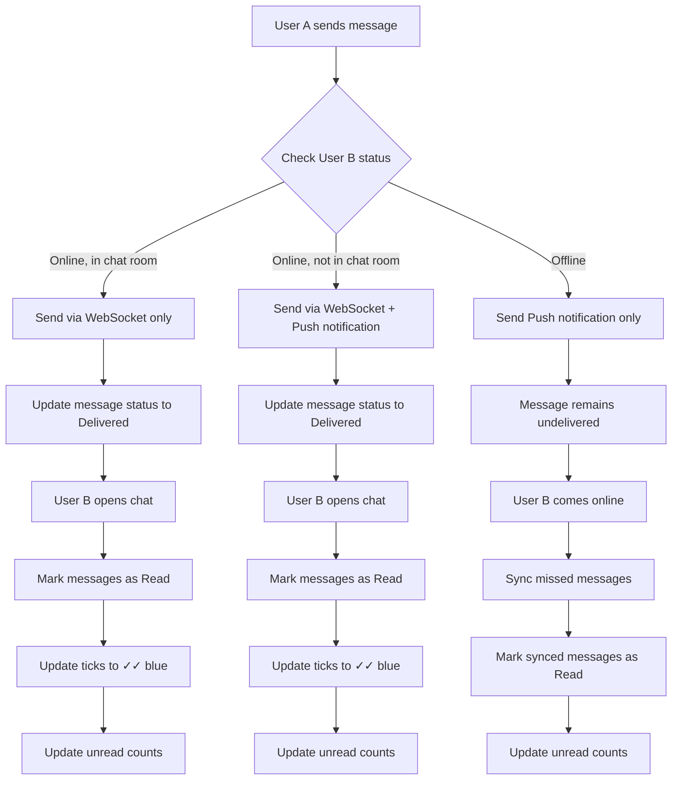
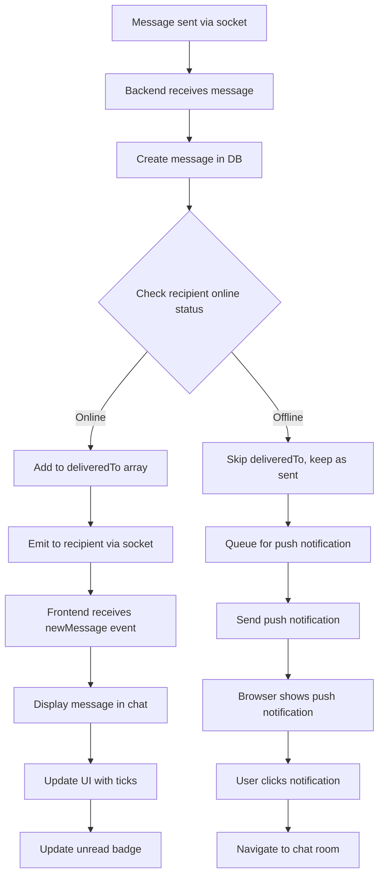
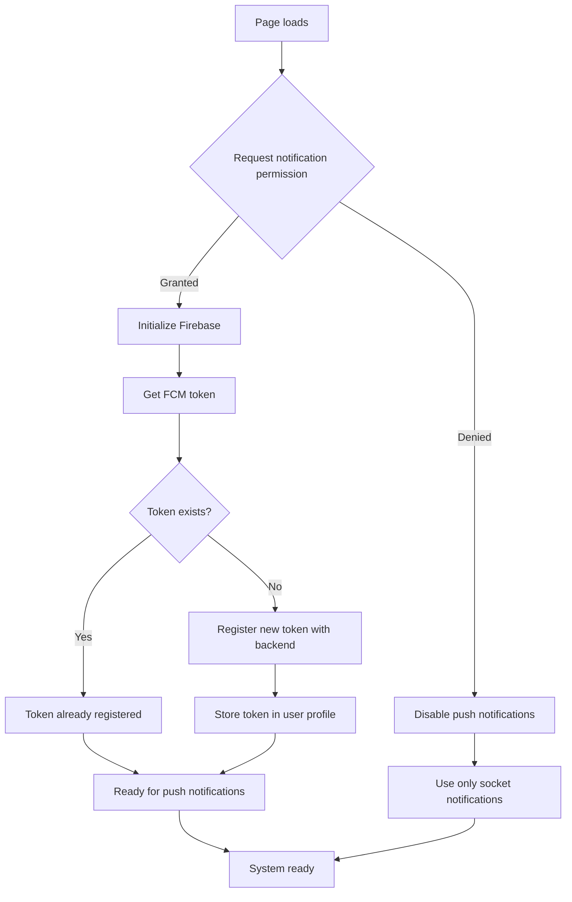

# Frontend Notification Implementation Guide

This guide provides a comprehensive, step-by-step approach to implementing notifications in the frontend using your backend services. It covers all aspects of the notification system including real-time updates, push notifications, and UI integration.

## Table of Contents
1. [Overview](#overview)
2. [System Flow Diagrams](#system-flow-diagrams)
3. [Prerequisites](#prerequisites)
4. [Real-time Socket Notifications](#real-time-socket-notifications)
5. [Push Notifications](#push-notifications)
6. [UI Integration](#ui-integration)
7. [Error Handling](#error-handling)
8. [Testing](#testing)

## System Flow Diagrams

### 1. Overall Notification Flow



### 2. Real-time Socket Notification Flow



### 3. Message Tick System Flow

```mermaid
graph TB
    A[Message sent by User A] --> B{Check message status}
    B -->|Not delivered yet| C[Show ✓ (single grey)]
    B -->|Delivered to User B's device| D[Show ✓✓ (double grey)]
    B -->|Read by User B| E[Show ✓✓ (double blue)]
    
    C --> F[User B comes online]
    D --> G[User B opens chat]
    E --> H[Final state - message read]
    
    F --> D
    G --> E
    
    style C fill:#ffebee
    style D fill:#e8f5e8
    style E fill:#e3f2fd
```

### 4. Push Notification Registration Flow



### 5. Unread Count Management Flow

```mermaid
graph TB
    A[New message arrives] --> B{Recipient in chat room?}
    B -->|Yes| C[Mark as read immediately]
    B -->|No| D[Increment unread count in unreadMap]
    C --> E[Update ticks to ✓✓ blue]
    D --> F[Show unread badge]
    
    F --> G[User opens chat room]
    G --> H[Call markAsRead API]
    H --> I[Backend sets unreadMap[userId] = 0]
    I --> J[Remove unread badge]
    E --> K[Final state updated]
    J --> K
    
    style D fill:#fff3e0
    style J fill:#e8f5e8
```

## Overview

The notification system consists of two main components:
- **Real-time notifications**: Using WebSocket connections for instant message delivery
- **Push notifications**: Browser-based notifications for offline users

## Prerequisites

Before implementing notifications, ensure you have:
- Backend server running with socket support
- Firebase configured for push notifications
- JWT tokens for authentication
- User roles (male/female) properly set up

## Real-time Socket Notifications

### Step 1: Initialize Socket Connection

```javascript
// Initialize socket connection
const socket = io('http://localhost:5001'); // Replace with your backend URL

// Authenticate with JWT token
socket.emit('authenticate', jwtToken);

socket.on('authenticated', () => {
  console.log('Socket authentication successful');
});
```

### Step 2: Handle New Message Notifications

```javascript
// Listen for new messages
socket.on('newMessage', (message) => {
  // Display message in chat
  renderMessage(message);
  
  // Update unread count
  updateUnreadCount(message.chatRoomId);
  
  // Play sound if needed
  playNotificationSound();
});

function renderMessage(message) {
  const messageDiv = document.createElement('div');
  messageDiv.className = `message ${message.senderType === currentUser.type ? 'sent' : 'received'}`;
  
  // Format message with ticks based on delivery/read status
  const ticks = getMessageTicks(message);
  
  messageDiv.innerHTML = `
    <div class="message-content">${formatMessageContent(message)}</div>
    <div class="message-time">${formatTime(message.createdAt)} ${ticks}</div>
  `;
  
  document.getElementById('messages-container').appendChild(messageDiv);
}

function getMessageTicks(message) {
  // Check if message is sent by current user
  if (message.senderType !== currentUser.type) {
    return ''; // No ticks for received messages
  }
  
  // Check read status
  const isRead = message.readBy && message.readBy.some(readEntry => 
    readEntry.userId.toString() !== currentUser.id.toString()
  );
  
  if (isRead) {
    return '<span class="ticks blue">✓✓</span>'; // Double blue ticks (read)
  }
  
  // Check delivery status
  const isDelivered = message.deliveredTo && message.deliveredTo.some(deliveryEntry => 
    deliveryEntry.userId.toString() !== currentUser.id.toString()
  );
  
  if (isDelivered) {
    return '<span class="ticks grey">✓✓</span>'; // Double grey ticks (delivered)
  }
  
  return '<span class="ticks grey">✓</span>'; // Single grey tick (sent)
}
```

### Step 3: Handle Message Read Updates

```javascript
// Listen for message read receipts
socket.on('messageRead', (readData) => {
  updateMessageTicks(readData.messageIds);
});

function updateMessageTicks(messageIds) {
  messageIds.forEach(msgId => {
    const messageElement = document.querySelector(`[data-message-id="${msgId}"]`);
    if (messageElement) {
      const tickElement = messageElement.querySelector('.ticks');
      if (tickElement) {
        tickElement.innerHTML = '✓✓';
        tickElement.className = 'ticks blue';
      }
    }
  });
}
```

### Step 4: Handle Typing Indicators

```javascript
// Listen for typing indicators
socket.on('typing', (typingData) => {
  if (typingData.roomId === currentRoomId) {
    showTypingIndicator(typingData.userId);
  }
});

function showTypingIndicator(userId) {
  // Show typing indicator in chat header
  const otherUser = getCurrentRoomOtherUser();
  if (otherUser && otherUser._id.toString() === userId.toString()) {
    document.getElementById('typing-indicator').style.display = 'block';
    
    // Hide after 2 seconds if no further typing events
    setTimeout(() => {
      document.getElementById('typing-indicator').style.display = 'none';
    }, 2000);
  }
}

// Emit typing event when user starts typing
function emitTyping() {
  socket.emit('typing', { roomId: currentRoomId });
}
```

### Step 5: Handle User Status Updates

```javascript
// Listen for user status changes
socket.on('userStatusChanged', (statusData) => {
  updateUserStatusInUI(statusData.userId, statusData.isOnline);
});

function updateUserStatusInUI(userId, isOnline) {
  // Update online status in chat header
  const chatHeader = document.getElementById('chat-header');
  if (chatHeader) {
    const statusSpan = chatHeader.querySelector('.user-status');
    if (statusSpan) {
      statusSpan.textContent = isOnline ? 'Online' : 'Offline';
      statusSpan.className = `user-status ${isOnline ? 'online' : 'offline'}`;
    }
  }
  
  // Update sidebar
  const chatItems = document.querySelectorAll(`.chat-item[data-user-id="${userId}"]`);
  chatItems.forEach(item => {
    const statusIndicator = item.querySelector('.status-indicator');
    if (statusIndicator) {
      statusIndicator.className = `status-indicator ${isOnline ? 'online' : 'offline'}`;
      statusIndicator.textContent = isOnline ? '● Online' : '● Offline';
    }
  });
}
```

## Push Notifications

### Step 1: Request Permission

```javascript
// Request notification permission
async function requestNotificationPermission() {
  if (!('Notification' in window)) {
    console.log('Notifications not supported');
    return false;
  }

  const permission = await Notification.requestPermission();
  if (permission === 'granted') {
    console.log('Notification permission granted');
    return true;
  }
  
  return false;
}
```

### Step 2: Initialize Firebase for Push Notifications

```javascript
// Initialize Firebase
import { initializeApp } from 'firebase/app';
import { getMessaging, getToken, onMessage } from 'firebase/messaging';

const firebaseConfig = {
  apiKey: "YOUR_API_KEY",
  authDomain: "YOUR_AUTH_DOMAIN",
  projectId: "YOUR_PROJECT_ID",
  messagingSenderId: "YOUR_SENDER_ID",
  appId: "YOUR_APP_ID"
};

const app = initializeApp(firebaseConfig);
const messaging = getMessaging(app);

// Request FCM token
async function requestFCMToken() {
  try {
    const token = await getToken(messaging, {
      vapidKey: 'YOUR_VAPID_KEY'
    });
    
    if (token) {
      // Send token to backend
      await saveFCMToken(token);
      return token;
    } else {
      console.log('No registration token available. Request permission to generate one.');
      return null;
    }
  } catch (error) {
    console.error('Error getting FCM token:', error);
    return null;
  }
}

// Save FCM token to backend
async function saveFCMToken(token) {
  const response = await fetch('/notification/save-token', {
    method: 'POST',
    headers: {
      'Content-Type': 'application/json',
      'Authorization': `Bearer ${jwtToken}`
    },
    body: JSON.stringify({
      fcmToken: token,
      platform: 'web'
    })
  });
  
  if (!response.ok) {
    throw new Error('Failed to save FCM token');
  }
}
```

### Step 3: Handle Incoming Push Messages

```javascript
// Handle foreground messages
onMessage(messaging, (payload) => {
  console.log('Foreground message received:', payload);
  
  // Display notification in UI
  showLocalNotification(
    payload.notification.title,
    payload.notification.body,
    payload.data
  );
});

function showLocalNotification(title, body, data) {
  // Create notification element
  const notificationDiv = document.createElement('div');
  notificationDiv.className = 'local-notification';
  notificationDiv.innerHTML = `
    <h4>${title}</h4>
    <p>${body}</p>
    <button onclick="openChat('${data.roomId}')">View</button>
  `;
  
  document.getElementById('notifications-container').appendChild(notificationDiv);
  
  // Auto-hide after 5 seconds
  setTimeout(() => {
    notificationDiv.remove();
  }, 5000);
}
```

### Step 4: Subscribe to Push Notifications

```javascript
// Subscribe to push notifications
async function subscribeToPushNotifications() {
  const permissionGranted = await requestNotificationPermission();
  if (!permissionGranted) {
    console.log('Notification permission denied');
    return;
  }
  
  const fcmToken = await requestFCMToken();
  if (!fcmToken) {
    console.log('Failed to get FCM token');
    return;
  }
  
  console.log('Successfully subscribed to push notifications');
}
```

## UI Integration

### Step 1: Create Notification Badge

```html
<!-- Chat item with unread badge -->
<div class="chat-item" onclick="openChat(roomId)">
  
  <div class="chat-info">
    <div class="user-name">John Doe</div>
    <div class="last-message">Last message content...</div>
  </div>
  <div class="unread-badge" id="unread-${roomId}">0</div>
</div>
```

### Step 2: Update Unread Counts

```javascript
// Update unread count for a specific chat
function updateUnreadCount(roomId, count) {
  const badgeElement = document.getElementById(`unread-${roomId}`);
  if (badgeElement) {
    badgeElement.textContent = count > 0 ? count : '';
    badgeElement.style.display = count > 0 ? 'block' : 'none';
  }
  
  // Update total unread count in title
  updateTotalUnreadCount();
}

// Update total unread count in page title
function updateTotalUnreadCount() {
  const allBadges = document.querySelectorAll('.unread-badge');
  let totalCount = 0;
  
  allBadges.forEach(badge => {
    const count = parseInt(badge.textContent) || 0;
    totalCount += count;
  });
  
  if (totalCount > 0) {
    document.title = `(${totalCount}) Friend Circle`;
  } else {
    document.title = 'Friend Circle';
  }
}
```

### Step 3: Mark Messages as Read

```javascript
// Mark messages as read when opening a chat
function markMessagesAsRead(roomId, messageIds = []) {
  socket.emit('markAsRead', {
    roomId: roomId,
    messageIds: messageIds
  });
  
  // Update unread count locally
  updateUnreadCount(roomId, 0);
}

// Automatically mark as read when user opens chat
function openChat(roomId) {
  // Set as active room
  currentRoomId = roomId;
  
  // Load messages
  loadMessages(roomId);
  
  // Mark all unread messages as read
  markMessagesAsRead(roomId);
}
```

### Step 4: Notification Settings

```javascript
// Notification settings component
class NotificationSettings {
  constructor() {
    this.loadSettings();
  }
  
  loadSettings() {
    const settings = localStorage.getItem('notificationSettings');
    if (settings) {
      this.settings = JSON.parse(settings);
    } else {
      // Default settings
      this.settings = {
        enableSound: true,
        enableVisual: true,
        enablePush: true
      };
    }
  }
  
  saveSettings() {
    localStorage.setItem('notificationSettings', JSON.stringify(this.settings));
  }
  
  updateSetting(setting, value) {
    this.settings[setting] = value;
    this.saveSettings();
  }
  
  getSetting(setting) {
    return this.settings[setting];
  }
}

// Initialize notification settings
const notificationSettings = new NotificationSettings();
```

## Error Handling

### Step 1: Socket Connection Errors

```javascript
// Handle socket connection errors
socket.on('connect_error', (error) => {
  console.error('Socket connection error:', error);
  showConnectionError('Connection lost. Retrying...');
});

socket.on('reconnect', (attemptNumber) => {
  console.log('Socket reconnected after', attemptNumber, 'attempts');
  hideConnectionError();
});

socket.on('disconnect', (reason) => {
  console.log('Socket disconnected:', reason);
  if (reason === 'io server disconnect') {
    // The disconnection was initiated by the server
    socket.connect();
  }
});
```

### Step 2: Authentication Errors

```javascript
// Handle authentication errors
socket.on('authentication_error', (error) => {
  console.error('Socket authentication failed:', error);
  redirectToLogin();
});

function redirectToLogin() {
  // Clear JWT token
  localStorage.removeItem('jwtToken');
  
  // Redirect to login page
  window.location.href = '/login';
}
```

### Step 3: Message Sending Errors

```javascript
// Handle message sending errors
socket.on('error', (errorData) => {
  console.error('Socket error:', errorData);
  showErrorToast(errorData.message);
});

function showErrorToast(message) {
  const toast = document.createElement('div');
  toast.className = 'error-toast';
  toast.textContent = message;
  document.body.appendChild(toast);
  
  // Remove after 3 seconds
  setTimeout(() => {
    toast.remove();
  }, 3000);
}
```

## Testing

### Step 1: Test Real-time Notifications

1. Open two browser windows/tabs
2. Log in with different users
3. Send a message from one user to another
4. Verify the message appears instantly in the other user's chat
5. Check that ticks update correctly when messages are read

### Step 2: Test Push Notifications

1. Send a message to a user who is offline
2. Verify push notification is received when user comes online
3. Test notification permission handling
4. Verify FCM token registration

### Step 3: Test Unread Counts

1. Send messages to a user without opening the chat
2. Verify unread badge increments correctly
3. Open the chat and verify badge resets
4. Test with multiple chats simultaneously

### Step 4: Test Online Status

1. Have one user go online/offline
2. Verify status updates appear in other user's chat
3. Test status persistence across page refreshes

## Best Practices

1. **Always authenticate socket connections** before subscribing to events
2. **Handle network interruptions gracefully** with reconnection logic
3. **Optimize notification frequency** to avoid spamming users
4. **Provide user control** over notification preferences
5. **Secure FCM tokens** and handle them appropriately
6. **Clean up event listeners** to prevent memory leaks
7. **Use local storage** for persistent settings
8. **Implement rate limiting** for notification sending

## Security Considerations

1. **Validate JWT tokens** on every socket event
2. **Sanitize message content** before displaying in UI
3. **Protect FCM tokens** from unauthorized access
4. **Implement proper authorization** for accessing chat rooms
5. **Use HTTPS** for all communication
6. **Validate user permissions** before sending notifications

This comprehensive guide covers all aspects of implementing notifications in your frontend application using the backend services. Follow these steps carefully to ensure a robust and reliable notification system.