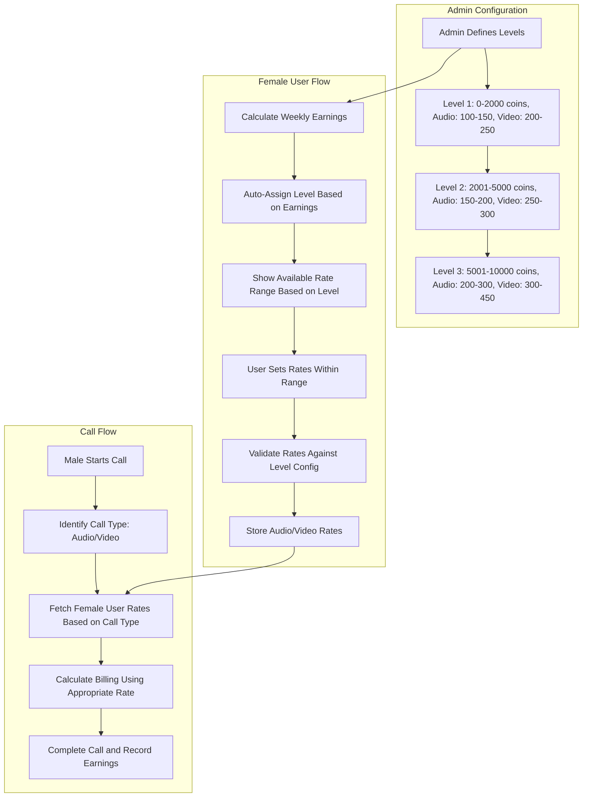
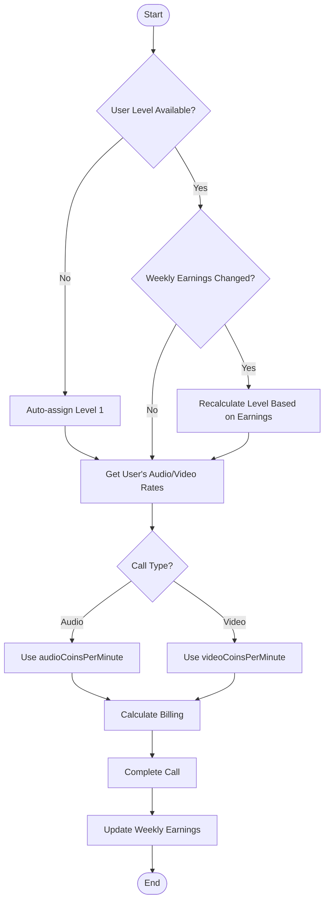
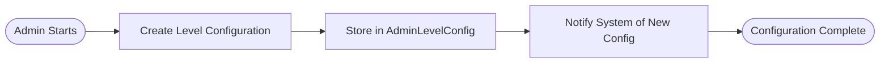
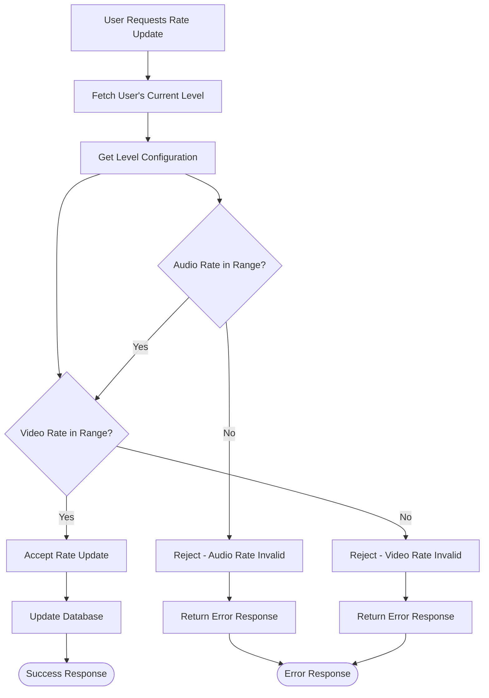

# Level-Based Call Rate System - Flow Diagram

## System Overview

```mermaid
graph TB
    subgraph "Admin Configuration"
        A1[Admin Defines Levels] --> A2[Level 1: 0-2000 coins, Audio: 100-150, Video: 200-250]
        A2 --> A3[Level 2: 2001-5000 coins, Audio: 150-200, Video: 250-300]
        A3 --> A4[Level 3: 5001-10000 coins, Audio: 200-300, Video: 300-450]
    end
    
    subgraph "Female User Flow"
        B1[Calculate Weekly Earnings] --> B2[Auto-Assign Level Based on Earnings]
        B2 --> B3[Show Available Rate Range Based on Level]
        B3 --> B4[User Sets Rates Within Range]
        B4 --> B5[Validate Rates Against Level Config]
        B5 --> B6[Store Audio/Video Rates]
    end
    
    subgraph "Call Flow"
        C1[Male Starts Call] --> C2[Identify Call Type: Audio/Video]
        C2 --> C3[Fetch Female User Rates Based on Call Type]
        C3 --> C4[Calculate Billing Using Appropriate Rate]
        C4 --> C5[Complete Call and Record Earnings]
    end
    
    A1 --> B1
    B6 --> C3
```

## Detailed Process Flow

```mermaid
graph TD
    Start([Start]) --> CheckLevel{User Level Available?}
    
    CheckLevel -->|No| AssignLevel[Auto-assign Level 1]
    CheckLevel -->|Yes| CheckEarnings{Weekly Earnings Changed?}
    
    AssignLevel --> GetUserRates[Get User's Audio/Video Rates]
    CheckEarnings -->|Yes| RecalculateLevel[Recalculate Level Based on Earnings]
    CheckEarnings -->|No| GetUserRates
    
    RecalculateLevel --> GetUserRates
    
    GetUserRates --> CheckCallType{Call Type?}
    
    CheckCallType -->|Audio| UseAudioRate[Use audioCoinsPerMinute]
    CheckCallType -->|Video| UseVideoRate[Use videoCoinsPerMinute]
    
    UseAudioRate --> CalculateBilling[Calculate Billing]
    UseVideoRate --> CalculateBilling
    
    CalculateBilling --> CompleteCall[Complete Call]
    CompleteCall --> UpdateEarnings[Update Weekly Earnings]
    UpdateEarnings --> End([End])
```

## Admin Configuration Flow

```mermaid
graph LR
    AdminStart([Admin Starts]) --> CreateLevel[Create Level Configuration]
    CreateLevel --> StoreConfig[Store in AdminLevelConfig]
    StoreConfig --> NotifyUsers[Notify System of New Config]
    NotifyUsers --> EndConfig([Configuration Complete])
```

## Rate Validation Flow

```mermaid
graph TD
    UserReq[User Requests Rate Update] --> FetchLevel[Fetch User's Current Level]
    FetchLevel --> GetConfig[Get Level Configuration]
    GetConfig --> ValidateAudio{Audio Rate in Range?}
    GetConfig --> ValidateVideo{Video Rate in Range?}
    
    ValidateAudio -->|Yes| ValidateVideo
    ValidateAudio -->|No| RejectAudio[Reject - Audio Rate Invalid]
    
    ValidateVideo -->|Yes| AcceptUpdate[Accept Rate Update]
    ValidateVideo -->|No| RejectVideo[Reject - Video Rate Invalid]
    
    AcceptUpdate --> UpdateDB[Update Database]
    RejectAudio --> ErrorResp1[Return Error Response]
    RejectVideo --> ErrorResp2[Return Error Response]
    
    UpdateDB --> SuccessResp([Success Response])
    ErrorResp1 --> ErrorEnd([Error Response])
    ErrorResp2 --> ErrorEnd
```